# API Testing Demo V2

Ce projet raconte une histoire simple: un client obtient un `JWT`, crée une commande sur une API FastAPI, l'API persiste la commande en base SQL, envoie une notification à un microservice dédié, puis une interface `/dashboard` affiche l'état du système.  
L'objectif du dépôt est de montrer, sur ce même fil rouge, **11 types de tests API** avec de vraies exécutions, de vraies sorties et des captures incluses dans ce README.

## Le scénario métier

1. Le service d'auth émet un token via `/oauth/token`.
2. Le client appelle `POST /api/orders` avec un `Bearer JWT`.
3. L'API écrit la commande en SQL et décrémente le stock.
4. L'API appelle le microservice de notification.
5. Le dashboard lit `/api/dashboard-data` et affiche l'état courant.

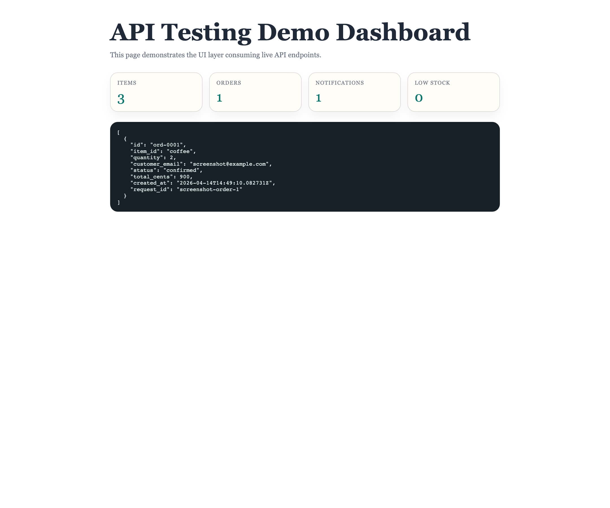

## Les 11 types couverts

| # | Type | Rôle dans ce projet |
| --- | --- | --- |
| 1 | `Smoke Testing` | Vérifier que l'API démarre et répond sur ses endpoints essentiels. |
| 2 | `Functional Testing` | Vérifier les règles métier normales de création et lecture de commandes. |
| 3 | `Integration Testing` | Vérifier que l'API, la base et le service de notification travaillent ensemble. |
| 4 | `Regression Testing` | Verrouiller des comportements fragiles déjà validés. |
| 5 | `Load Testing` | Mesurer le comportement sous charge attendue. |
| 6 | `Stress Testing` | Pousser le système plus fort pour observer sa tenue en limite. |
| 7 | `Security Testing` | Vérifier l'authentification, les refus de payloads dangereux et la non-exposition de données internes. |
| 8 | `UI Testing` | Vérifier que l'interface consomme bien l'API et reflète l'état réel du système. |
| 9 | `Fuzz Testing` | Envoyer des données invalides ou aléatoires pour tester la robustesse. |
| 10 | `Reliability Testing` | Vérifier la stabilité sur des appels répétés dans la durée. |
| 11 | `Contract Testing` | Vérifier que les réponses JSON respectent les schémas attendus. |

## Stack utilisée

| Composant | Rôle |
| --- | --- |
| `app/main.py` | API métier FastAPI |
| `services/auth_service/main.py` | Service d'auth JWT |
| `services/notification_service/main.py` | Microservice de notification |
| `SQLite` | Base locale rapide pour les tests hors Docker |
| `Postgres` | Base externe en environnement Docker Compose |
| `Playwright` | Test UI navigateur réel |
| `JMeter` | Tests de charge et de stress |
| `Docker Compose` | Environnement distribué réaliste |
| `OWASP ZAP` | Point d'entrée pour un scan sécurité de base |

## Démarrage rapide

Exécution locale simple :

```bash
make run
```

Pile distribuée Docker :

```bash
make docker-up
```

Token local de démonstration :

```bash
make token
```

Campagne de tests :

```bash
make test
make test-ui
make load
make stress
```

## Résultat global de la campagne

Dernière campagne documentée localement le **14 avril 2026**.

| Vérification | Résultat observé |
| --- | --- |
| Suite API | `19 passed in 10.86s` |
| Suite UI navigateur | `2 passed (8.3s)` |
| Load | `900 samples`, `92.7/s`, `0.00% error` |
| Stress | `4800 samples`, `258.5/s`, `0.00% error` |
| Docker Compose | `config validée` |

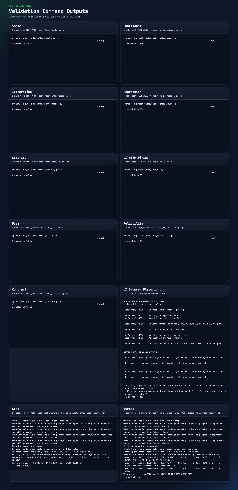

## Comment lire les sections de test

Pour les suites `pytest`, [tests/conftest.py](./tests/conftest.py) démarre une vraie mini-stack HTTP locale et les tests parlent à l'application via `httpx`.  
Pour l'UI navigateur, la campagne passe par [playwright/tests/dashboard.spec.js](./playwright/tests/dashboard.spec.js).  
Pour la performance, les plans JMeter sont dans [jmeter/load-test-plan.jmx](./jmeter/load-test-plan.jmx) et [jmeter/stress-test-plan.jmx](./jmeter/stress-test-plan.jmx).

## 1. Smoke Testing

- `Ce que l'on teste` : le démarrage de l'API et la disponibilité des endpoints de base.
- `Pourquoi` : c'est le garde-fou le plus rapide pour savoir si la plateforme est simplement vivante.
- `Comment` : [tests/test_smoke.py](./tests/test_smoke.py) appelle `/health` et `/api/items`.
- `Ce que cela permet de démontrer` : l'API répond bien sur un vrai serveur HTTP avec un catalogue initial cohérent.
- `Commande` : `make test TEST_ARGS='tests/test_smoke.py -q'`
- `Résultat observé` : `2 passed in 3.41s`
- `Sortie brute` : [docs/validation/raw/smoke.txt](./docs/validation/raw/smoke.txt)

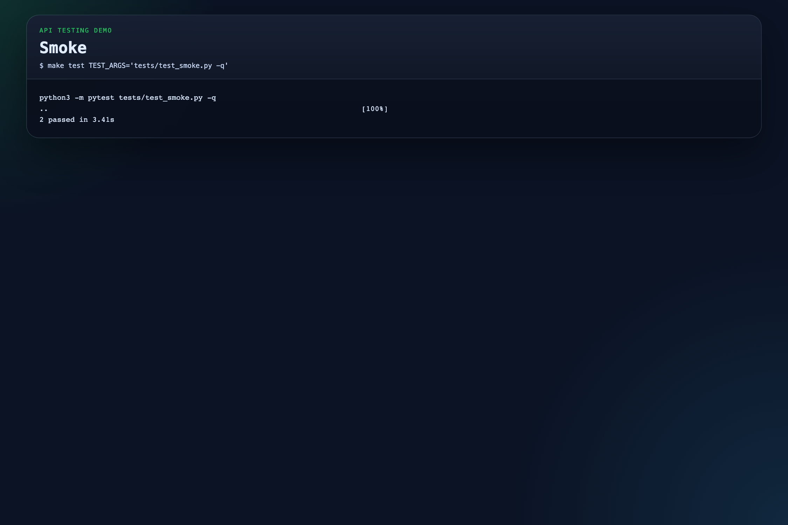

## 2. Functional Testing

- `Ce que l'on teste` : la création de commande valide, le rejet d'un payload invalide et la lecture d'une commande créée.
- `Pourquoi` : il faut vérifier que le métier fonctionne avant de tester des scénarios plus complexes.
- `Comment` : [tests/test_functional.py](./tests/test_functional.py) crée une commande, attend un `201`, puis vérifie la lecture et les validations `422`.
- `Ce que cela permet de démontrer` : le cœur métier de l'API respecte les règles prévues pour un client normal.
- `Commande` : `make test TEST_ARGS='tests/test_functional.py -q'`
- `Résultat observé` : `3 passed in 4.93s`
- `Sortie brute` : [docs/validation/raw/functional.txt](./docs/validation/raw/functional.txt)

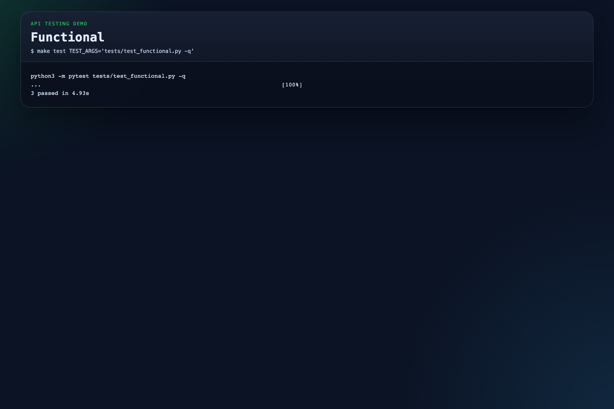

## 3. Integration Testing

- `Ce que l'on teste` : la coordination entre la commande, le stock, le résumé dashboard et le service de notification.
- `Pourquoi` : une API peut être correcte seule mais fausse dès qu'elle dialogue avec d'autres composants.
- `Comment` : [tests/test_integration.py](./tests/test_integration.py) crée une commande, relit l'inventaire, relit le dashboard et vérifie la notification indirectement via les compteurs.
- `Ce que cela permet de démontrer` : la commande traverse bien toute la chaîne applicative, pas seulement une fonction isolée.
- `Commande` : `make test TEST_ARGS='tests/test_integration.py -q'`
- `Résultat observé` : `2 passed in 4.75s`
- `Sortie brute` : [docs/validation/raw/integration.txt](./docs/validation/raw/integration.txt)

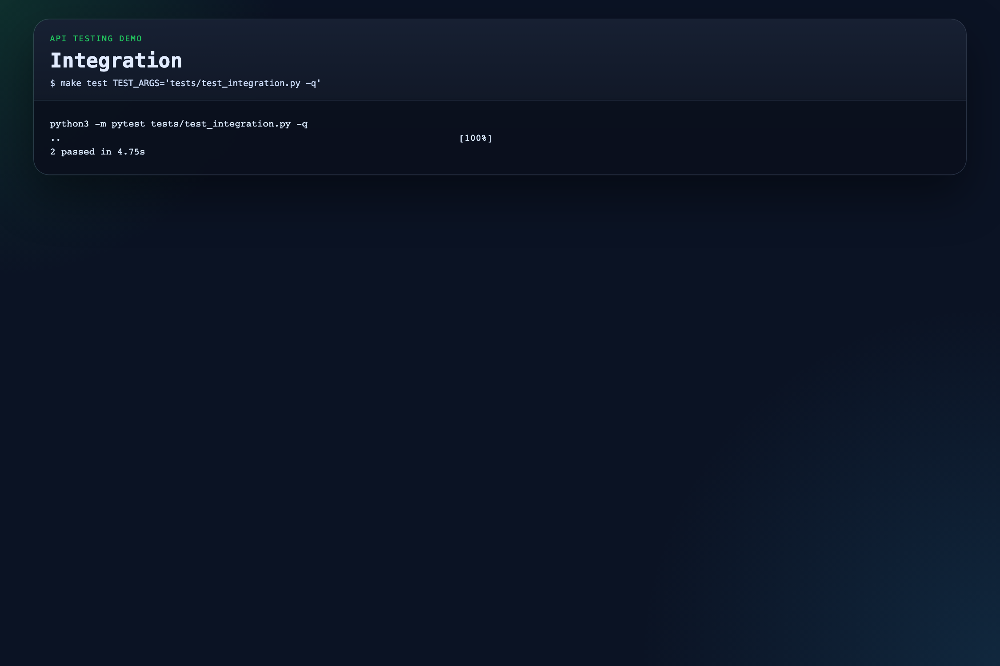

## 4. Regression Testing

- `Ce que l'on teste` : l'idempotence et la garantie qu'un échec métier ne modifie pas l'inventaire.
- `Pourquoi` : ce sont des comportements typiquement cassés lors d'évolutions ou de refactorings.
- `Comment` : [tests/test_regression.py](./tests/test_regression.py) rejoue deux fois la même requête avec `X-Request-Id`, puis vérifie qu'un échec de stock n'a pas d'effet de bord.
- `Ce que cela permet de démontrer` : les régressions les plus critiques sur la création de commande sont verrouillées.
- `Commande` : `make test TEST_ARGS='tests/test_regression.py -q'`
- `Résultat observé` : `2 passed in 4.83s`
- `Sortie brute` : [docs/validation/raw/regression.txt](./docs/validation/raw/regression.txt)


## 5. Load Testing

- `Ce que l'on teste` : le comportement de l'API sous charge attendue.
- `Pourquoi` : il faut vérifier que le système reste fluide dans un usage réaliste, pas seulement à vide.
- `Comment` : [jmeter/load-test-plan.jmx](./jmeter/load-test-plan.jmx) enchaîne des appels sur `health`, `items` et `orders` après reset de l'état de test.
- `Ce que cela permet de démontrer` : la plateforme tient une charge locale stable sans erreur sur la campagne documentée.
- `Commande` : `jmeter -n -t jmeter/load-test-plan.jmx -l docs/validation/raw/load-results.jtl`
- `Résultat observé` : `900 samples`, `93.2/s`, `0.00% error`
- `Sortie brute` : [docs/validation/raw/load.txt](./docs/validation/raw/load.txt)

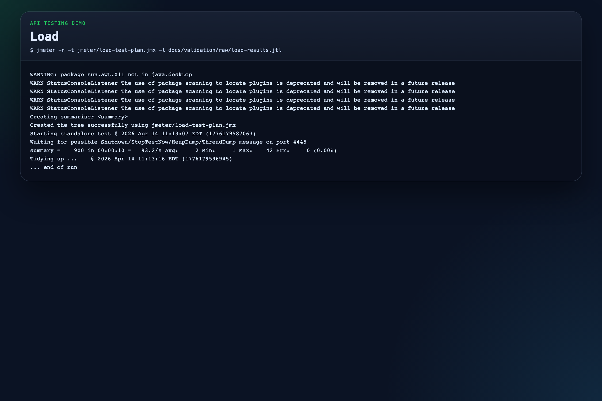

## 6. Stress Testing

- `Ce que l'on teste` : la tenue de l'API sous charge plus forte et plus agressive.
- `Pourquoi` : le stress test cherche la zone de fragilité du système et la manière dont il se comporte sous pression.
- `Comment` : [jmeter/stress-test-plan.jmx](./jmeter/stress-test-plan.jmx) pousse davantage les appels et la concurrence après un reset avec un stock plus grand.
- `Ce que cela permet de démontrer` : le système reste cohérent et termine la campagne locale sans erreur.
- `Commande` : `jmeter -n -t jmeter/stress-test-plan.jmx -l docs/validation/raw/stress-results.jtl`
- `Résultat observé` : `4800 samples`, `271.1/s`, `0.00% error`
- `Sortie brute` : [docs/validation/raw/stress.txt](./docs/validation/raw/stress.txt)

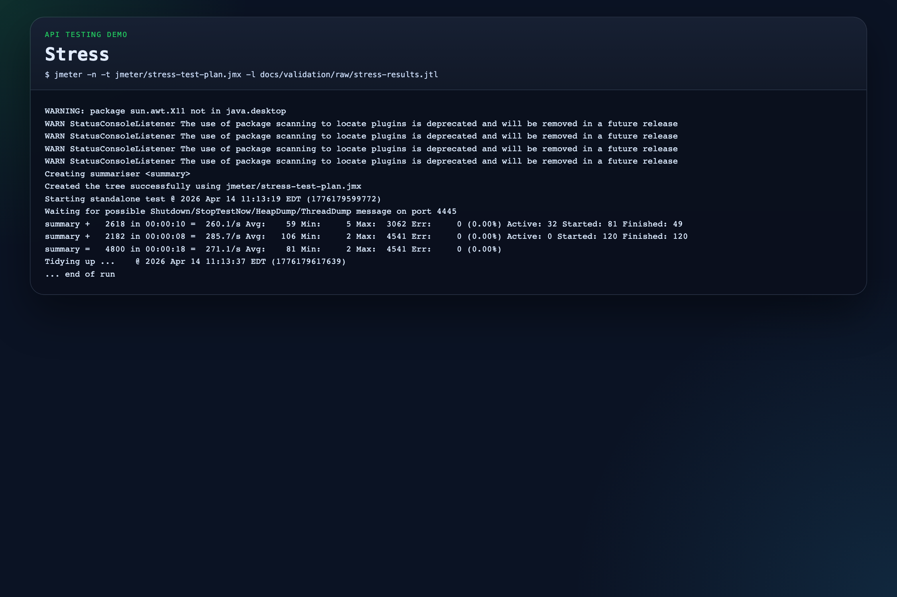

## 7. Security Testing

- `Ce que l'on teste` : l'obligation d'un `Bearer JWT`, le rejet d'un mauvais token, le blocage d'un payload scripté et la non-fuite de champs internes.
- `Pourquoi` : une API de commande ne doit ni accepter des écritures anonymes ni exposer des détails de structure internes.
- `Comment` : [tests/test_security.py](./tests/test_security.py) appelle `POST /api/orders` avec et sans authentification, puis injecte un contenu malveillant dans `notes`.
- `Ce que cela permet de démontrer` : la surface d'écriture est protégée et la validation défensive fonctionne sur les cas critiques de la démo.
- `Commande` : `make test TEST_ARGS='tests/test_security.py -q'`
- `Résultat observé` : `4 passed in 4.78s`
- `Sortie brute` : [docs/validation/raw/security.txt](./docs/validation/raw/security.txt)


## 8. UI Testing

- `Ce que l'on teste` : le lien entre l'interface `/dashboard` et l'API, d'abord côté HTML/JS, puis dans un vrai navigateur.
- `Pourquoi` : une API peut être correcte côté backend tout en étant mal intégrée côté écran.
- `Comment` : [tests/test_ui.py](./tests/test_ui.py) vérifie le câblage HTTP et le bootstrap de données ; [playwright/tests/dashboard.spec.js](./playwright/tests/dashboard.spec.js) ouvre Chromium et vérifie la mise à jour réelle de l'écran.
- `Ce que cela permet de démontrer` : le dashboard consomme bien l'API et reflète un ordre créé dans le système.
- `Commande HTTP` : `make test TEST_ARGS='tests/test_ui.py -q'`
- `Résultat HTTP` : `2 passed in 4.78s`
- `Sortie brute HTTP` : [docs/validation/raw/ui-http.txt](./docs/validation/raw/ui-http.txt)
- `Commande navigateur` : `npm run ui:test -- --reporter=line`
- `Résultat navigateur` : `2 passed (6.4s)`
- `Sortie brute navigateur` : [docs/validation/raw/ui-browser.txt](./docs/validation/raw/ui-browser.txt)

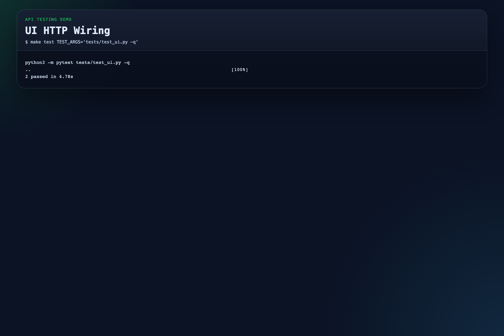

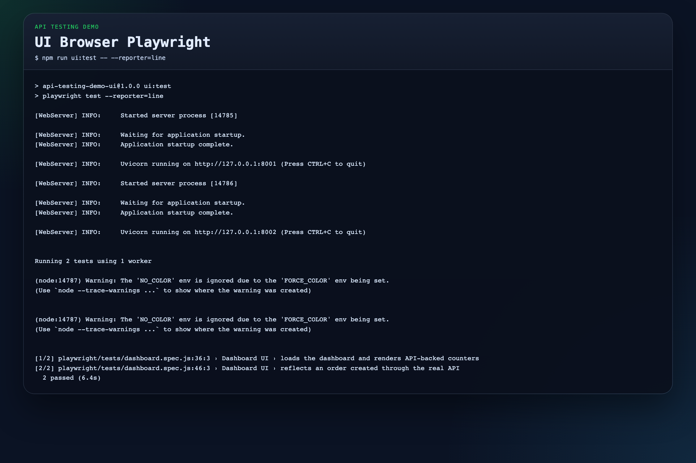

## 9. Fuzz Testing

- `Ce que l'on teste` : la robustesse de l'API face à des valeurs absurdes, aléatoires ou invalides.
- `Pourquoi` : une API robuste doit refuser proprement les entrées inattendues, sans planter ni dériver.
- `Comment` : [tests/test_fuzz.py](./tests/test_fuzz.py) envoie 60 payloads variés avec des statuts attendus dans `{404, 409, 422}`.
- `Ce que cela permet de démontrer` : l'API reste défensive et rend des erreurs contrôlées sur des données non fiables.
- `Commande` : `make test TEST_ARGS='tests/test_fuzz.py -q'`
- `Résultat observé` : `1 passed in 4.52s`
- `Sortie brute` : [docs/validation/raw/fuzz.txt](./docs/validation/raw/fuzz.txt)

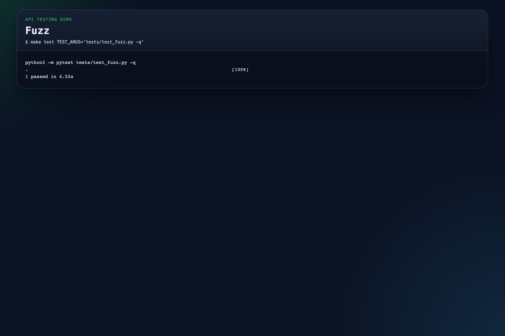

## 10. Reliability Testing

- `Ce que l'on teste` : la cohérence du système sous appels répétés et sur une durée plus longue que les autres suites.
- `Pourquoi` : certains défauts n'apparaissent qu'après accumulation d'opérations.
- `Comment` : [tests/test_reliability.py](./tests/test_reliability.py) boucle sur `health`, `items`, `orders` et crée périodiquement des commandes avec idempotence.
- `Ce que cela permet de démontrer` : les compteurs finaux, le stock et les notifications restent cohérents après de nombreux appels.
- `Commande` : `make test TEST_ARGS='tests/test_reliability.py -q'`
- `Résultat observé` : `1 passed in 6.20s`
- `Sortie brute` : [docs/validation/raw/reliability.txt](./docs/validation/raw/reliability.txt)

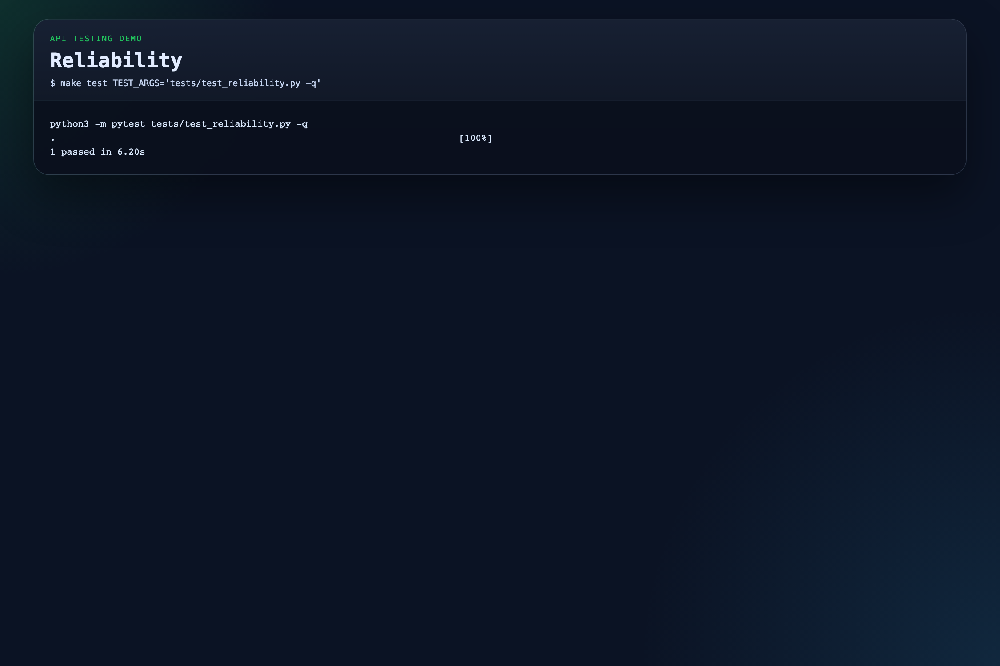

## 11. Contract Testing

- `Ce que l'on teste` : la conformité des réponses JSON aux schémas publiés.
- `Pourquoi` : les consommateurs de l'API dépendent de la structure des réponses, pas seulement du statut HTTP.
- `Comment` : [tests/test_contract.py](./tests/test_contract.py) valide les réponses avec [contracts/order.schema.json](./contracts/order.schema.json) et [contracts/order-list.schema.json](./contracts/order-list.schema.json).
- `Ce que cela permet de démontrer` : la forme des réponses est stabilisée pour les clients qui consomment l'API.
- `Commande` : `make test TEST_ARGS='tests/test_contract.py -q'`
- `Résultat observé` : `2 passed in 4.71s`
- `Sortie brute` : [docs/validation/raw/contract.txt](./docs/validation/raw/contract.txt)

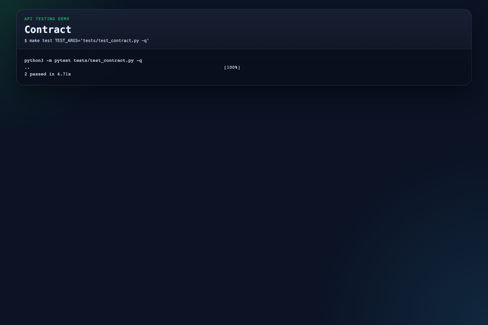

## Ce que ce projet permet de montrer

- Une API testée sur un vrai serveur HTTP et non sur un simple client mémoire.
- Une authentification `JWT Bearer` réelle dans le flux d'écriture.
- Une intégration multi-services avec persistance SQL et notification.
- Une couverture pédagogique claire des 11 grands types de tests API.
- Des captures d'exécution directement intégrées dans la documentation.

## Limites actuelles

- Les campagnes locales hors Docker tournent sur `SQLite`, pas sur `Postgres`.
- Le JWT est réel, mais sans provider OIDC complet type Keycloak.
- Le scan sécurité offensif via `ZAP` est prévu, mais il ne remplace pas un audit complet.
- Le service de notification reste volontairement simple pour garder une démo lisible.

## Fichiers utiles

- API : [app/main.py](./app/main.py)
- Persistance : [app/store.py](./app/store.py)
- Auth : [services/auth_service/main.py](./services/auth_service/main.py)
- Notification : [services/notification_service/main.py](./services/notification_service/main.py)
- Config Docker : [docker-compose.yml](./docker-compose.yml)
- Makefile : [Makefile](./Makefile)
